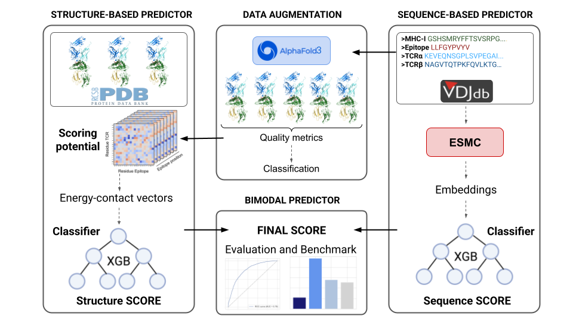

# Bimodal TCR

This project aims to predict TCR-peptide pairing based on sequence adn structural data, using position-specific matrices derived from TCR-peptide-MHC interactions and ESMC embeddings of TCR, peptide and MHC chains. 

## Pipeline Overview

The following diagram illustrates the overview of the method.

