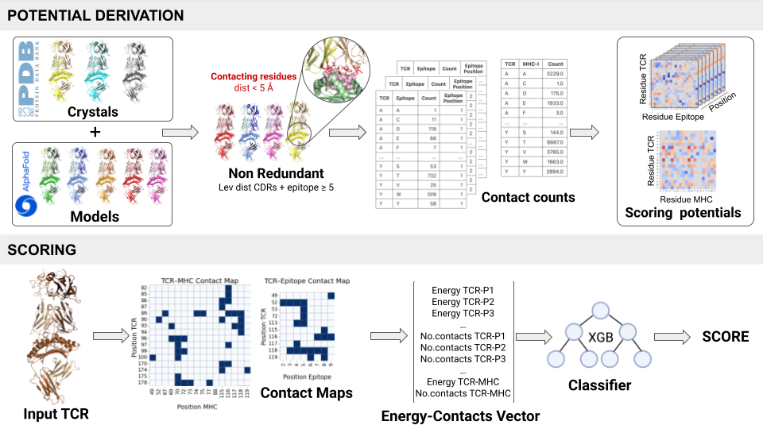

# strucTCR

This project aims to predict TCR-peptide pairing based on structural data, using position-specific matrices derived from TCR-peptide-MHC interactions. It incorporates MHC (Major Histocompatibility Complex) information, along with sequence clustering to reduce redundancy in the structural dataset.

## Project Overview

The core of the project involves predicting how T-cell receptors (TCRs) pair to peptide-major histocompatibility complex class I (pMHC) complexes. This is achieved by analyzing TCR-pMHC crystals retrieved from the Protein Data Bank (PDB), as well as synthetic structures generated through a data augmentation process using AlphaFold3 from VDJdb annotated complexes. The model is based on the creation of a statistical potential derived from peptide-position-specific TCR-peptide contacts and TCR-MHC contacts.

## Pipeline Overview

The following diagram illustrates the pipeline used in `strucTCR`, from structure preprocessing to binding prediction:



## Requirements

- Python 3.6 or later.

Required Python packages:

- pandas==2.2.2
- numpy==2.0.2
- biopython==1.84
- scipy==1.14.1
- tcrdist3==0.3
- anarci==1.3

You can install the required Python packages with the following command:

```bash
pip install -r requirements.txt
```


## Directory Structure

The project follows the following directory structure:

```bash
strucTCR/
│
├── data/                         # Data files
│   ├── pdb_files/                # PDB structure files
│   ├── contact_maps/             # Contact map files
│   ├── structures_annotation/    # Annotations and structure-related files
│   ├── all_mhc_seqs.csv          # Dataframe of MHC alleles, sequences
│
├── potentials/                   # Pre-computed interaction potentials
│
├── scripts/                      # Python scripts for processing
│   ├── select_nr_set.py          # Script to select nr structures
│   ├── contact_maps_pdb.py       # Script to extract contact maps
│   ├── potential_derivation.py   # Script to compute the interaction potential
│   ├── main.py                   # Main script to extract energy-contact vectors
│   ├── train_xgb.py              # Script to train XGBoost classifier
│   ├── inference.py              # Script to make predictions
│
├── src/                          # Source code (utilities and mapping)
│   ├── utils.py                  # Utility functions
│   ├── potential_calc.py         # Functions to generate and extract potential
│   ├── find_contact_map.py       # Functions to find the most similar TCR
│   ├── extract_contacts.py       # Functions to extract and filter contacts
│   ├── mapping.py                # Functions to map TCR, MHC, Peptide
│   ├── config.py                 # Configuration file
│
├── output/                       # Directory for output results
├── input/                        # Directory for input files
├── classifiers/                  # Directory with pre-trained classifiers
├── README.md                     # Project documentation
├── requirements.txt              # Python dependencies
└── pipeline.png                  # Scheme of the method
```


## How to Run the Script

1. Clone this repository:
```bash
   git clone https://github.com/Alexasparis/biTCR
   cd biTCR/StrucTCR
```
2. Install the required Python packages:
```bash
    pip install -r requirements.txt
```
3. If you want to derive your own potential and train a classifier:
```bash
  python potential_derivation.py -cm ../data/contact_maps -pdb ../data/pdb_files -out ../models/
  python main.py -i ../input/train_common_in.csv -tcrp ../potentials/New_TCR_p_potential -tcrm ../potentials/New_TCR_MHC_potential.csv -o ../output/train_common_out.csv -w 1 -v
  python train_xgb.py -in ../train_common_merged.csv -out classifiers/ --mhc
```

4. If you want to use a pre-trained potential and classifier:
```bash
  python main.py -i ../input/test_common_in.csv -tcrp ../potentials/Model-nr -tcrm ../potentials/TCR_MHC.csv -o ../output/test_common_out.csv -w 1 -v
  python inference.py -in ../test_common_merged.csv -out predicitons/ -metrics metrics_predictions/ -model ../classifiers/model_name.json
```


